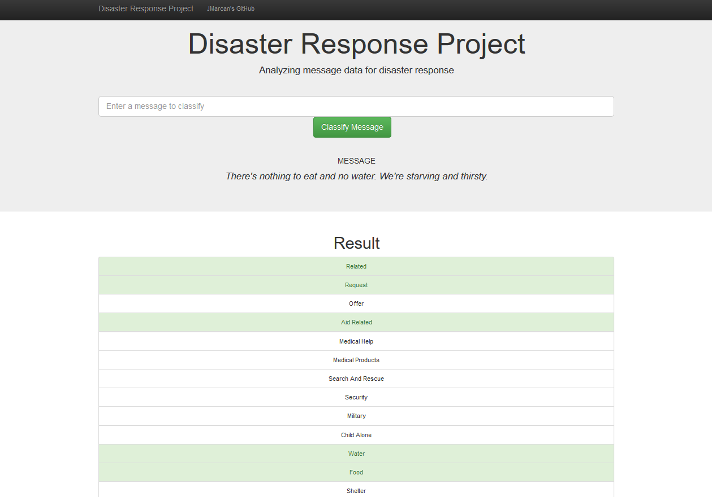

# Disaster Response ML Pipeline Web App, Natural Language Processing

## Project description
Projects as this helps to emergency services by classifying incoming messages 
so requests for help are quickly adressed to the corresponding agencies. 
This is especially important during natural disasters when emergency workers are overloaded and time is crucial.

- I've built ETL pipeline that loads database of real messages received during natural disasters, cleans them, and saves result prepared for Machine Learning into SQLite database.
- Then I've splitted data into training set and test set and created ML pipeline using Natural Language Processing library NLTK and scikit-learn's pipeline. The output is Multi-Output Supervised Learning Model categorizing incoming messages. I've optimized the model further by using GridSearchCV to fine-tune model parameters. The resulting model accuracy is in average 94%. The model is exported into pickle file to be further used.
- In the last step I've integrated Web App where you can input your message and get classification result.

The model is trained on real data provided by [Figure Eight](https://www.figure-eight.com/) received during natural disasters.

## Usage
1. Run the following commands in the project's root directory to set up your database and model.

    - To run ETL pipeline that cleans data and stores them in database prepared for machine learning
        `python data/process_data.py data/disaster_messages.csv data/disaster_categories.csv data/DisasterResponse.db`
    - To run ML pipeline that trains classifier and saves it to the file
        `python models/train_classifier.py data/DisasterResponse.db models/classifier.pkl`

2. Run the following command in the app's directory to run your web app.
    `python run.py`

3. Go to [http://127.0.0.1:3003/](http://127.0.0.1:3003) and enter messages you want to classify.

## Libraries used
Python 3
- pandas
- sqlalchemy 
- sklearn
- nltk
- flask
- plotly

## Files in the repository
- `data\process_data.py`: The ETL pipeline that process, cleans and stores in database prepared data for Machine Learning.
- `models\trains_classifier.py`: The Machine Learning pipeline that fits, tunes, evaluates and exports the model to pickle file.
- `app\run.py`: Starts the Flask server for the web app. User can in the web interface write messages he wants to classify.
- `app\templates\*.html`: HTML templates for the web app.