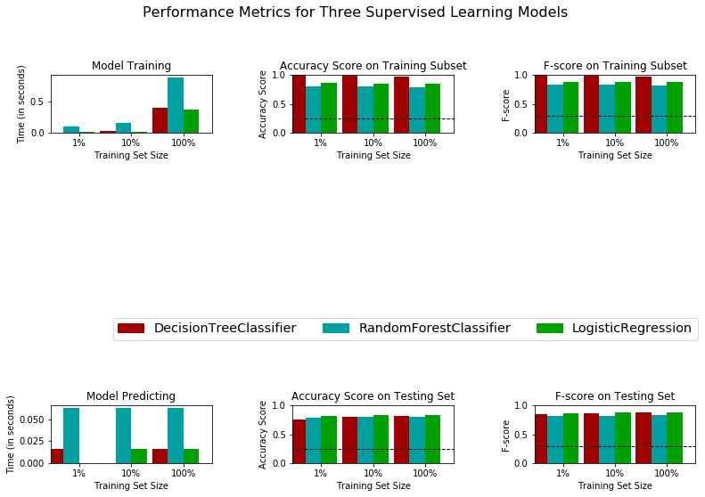

# Finding Donors

## Project description
Projects as this help to charities to focus their limited marketing resources on people who are most likely to donate to their cause.
The same approach is used by companies who want to target their audience.

- First, I've did data exploration. 
- Then I've implemented data preprocessing and prepared data for machine learning algorithm. For non-numeric features `one-hot encoding` was applied.
- Then I've splitted data between training and testing set.
- Then I've considered between the following supervised learning models: `Decision Tree`, `Random forest`, `Logistic regression`.
- To decide about the best model for a given task I've created a training and predicting pipeline and evaluated results. `Logistic Regression` was selected as it showed for the test data the best key indicators as the `highest f_score`, the `highest accuracy`, the `lowest predicting time`.
- Then I've described in `Layman's Term` how the final model works and how can the charity organisation use it.
- Then I've applied `GridSearchCV` to fine-tune model parameters
- Then I've identified the 5 most important features for predictions from the thirteen avaible features.
- Then I've retrained the model again only with the 5 most important features, which might be good step when training time is a factor.

The dataset for this project originates from the [UCI Machine Learning Repository](https://archive.ics.uci.edu/ml/datasets/Census+Income). The datset was donated by Ron Kohavi and Barry Becker, after being published in the article "Scaling Up the Accuracy of Naive-Bayes Classifiers: A Decision-Tree Hybrid". You can find the article by Ron Kohavi [online](https://www.aaai.org/Papers/KDD/1996/KDD96-033.pdf)

## Usage
1. Download the [dataset](https://archive.ics.uci.edu/ml/datasets/Census+Income)
2. Run finding_donors.ipynb

## Libraries used
Python 3
- numPy
- pandas
- scikit-learn
- Matplotlib

## Files in the repository
- `finding_donors.ipynb`: Contains executable source code